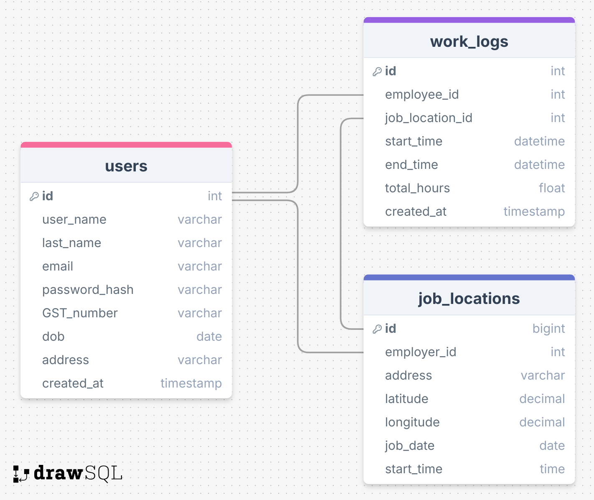
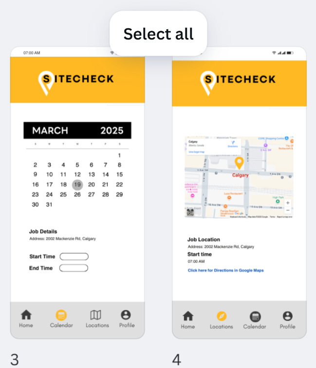

# Project Title

**SiteCheck App**

## Overview

**SiteCheck App** is a mobile-friendly web application that streamlines time tracking and job site management. Employers can log in as admins to track employee hours, manage payroll, and assign job locations. Employees can sign in, log hours, view job details, and receive notifications for upcoming jobs—all in one seamless platform.

### Problem Space

**SiteCheck App** is built for self-employed contractors and small business owners who need a simple and efficient way to track employee hours and manage job site details. Designed for teams working at different locations, it allows employers to log worked hours, assign job sites, and communicate job details effortlessly. Employees can sign in, track their time, view job locations, and receive updates—all in one streamlined platform

### User Profile

- **Employees**: Log hours, view job locations, and receive notifications about upcoming jobs.

- **Employer**: View and manage employee hours, input job locations, and export timesheets.

### Features

- **User Authentication**: Secure login system with JWT authentication.
- **Time Logging**: Employees can record their worked hours.
- **Job Location View**: Displays job site addresses using Google API (without tracking employees).
- **Admin Features**: Employer account has access to all employee data.

## Implementation

### Tech Stack

- **Frontend**: Vite with React

- **Backend**: Node.js with Express

- **Database**: MySQL with Knex.js for query building

- **Hosting**:

  - Backend: Railway
  - Database: Railway
  - Frontend: Vercel or Netlify

- **Authentication**: JSON Web Tokens (JWT)

### APIs

- **Google Maps API**: To display job locations
- **Custom Backend API**: To handle user authentication, time logging, job locations, and notifications

### Sitemap

1.  **Login Page** - Users authenticate and access their dashboard based on employee/employer roles
2.  **Employees**
    2.1 **Dashboard** - employee can see a summary or hours worked, jobs completed and today's job
    2.2 **Calendar** - employee can see jobs based on calendar day
    2.3 **Locations** - Job locations and details and map view of selected job
    2.4 **Timesheet** - employee can log today's hours and see their week's timesheet to generate invoice
    2.5 **Profile** - profile page contains all the employee's personal info including gst number
3.  **Employers**
    3.1 **Dashboard**
    3.2 **Jobs** - where employer can see all their jobs and create a new job that gets posted to the employee's calendar
    3.3 **Team** - employer can see all their team's information
    3.4 **Reports** - will keep track of employee earnings
    3.5 **Profile** - company profile with total employees, upcoming jobs that are active and total jobs
    3.6 _Client invoices_ - potentially adding a page for direct client invoicing
    3.7 _Contractor invoicing_ - potentially adding a page for installation invoicing to contractors

### Mockups

### Data

- **Users Table** (Employee & Employer data)
- **Work Logs Table** (Employee ID, hours worked, timestamps)
- **Job Locations Table** (Employer input, employee viewing access)

### Endpoints

- **User Authentication**:

  <!-- - `POST /api/auth/register` – Register a new user -->

  - `POST /api/auth/login` – Authenticate a user
  - `POST /api/auth/logout` – Log out a user

- **Time Logging**:

  - `POST /api/timesheet` – Log worked hours
  - `GET /api/timesheet/:userId` – Retrieve logged hours for an employee
  <!-- - `GET /api/timesheet/export` – Export timesheets -->

- **Job Location**:

  - `POST /api/jobs` – Employer adds job locations
  - `GET /api/jobs` – Employees view the next job location

- **Notifications**:

  - `POST /api/notifications` – Send notifications to employees

## Future Implementations

- **Direct Invoicing**: Employees can generate invoices from logged hours.
- **Mobile App Deployment**: Convert PWA to a native mobile app.
- **Timesheet Export**: Employees and the employer can export timesheets for payroll and invoicing.
- **Notifications**: Employees receive notifications about the next day's job location.
